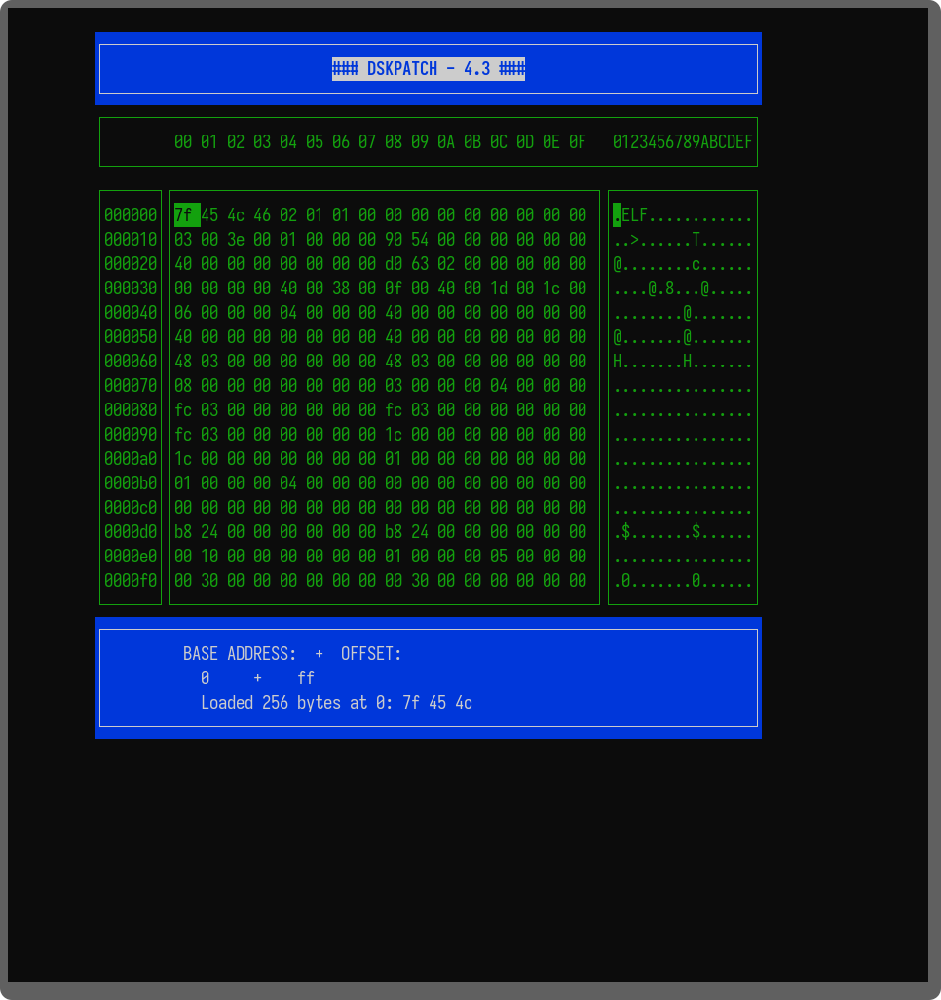

# 💻 Dskpatch 4.3

 

Um visualizador/editor hexadecimal para terminal, desenvolvido em C++ usando a biblioteca NCurses. Permite inspecionar e modificar o conteúdo binário de arquivos diretamente na linha de comando.

🌟 Recursos Principais

O Dskpatch oferece uma interface de terminal dividida, proporcionando uma experiência eficiente para inspeção binária:

    Visualização Dupla: Uma janela principal exibe os bytes em formato hexadecimal, e uma janela secundária adjacente mostra a interpretação dos mesmos bytes em ASCII.

    Janela de Comando: Uma área dedicada na parte inferior para inserir o endereço (offset) de deslocamento dentro do arquivo.

    Edição no Local: Permite modificar bytes diretamente na visualização.

    Navegação Rápida: Comandos de teclado para saltar entre blocos e navegar pelo conteúdo.

🛠️ Tecnologias

    Linguagem: C++

    Biblioteca de Terminal: NCurses

    Sistema de Build: CMake

⚙️ Instalação e Configuração

Pré-requisitos

Para compilar e executar o HexViewer, você precisará do seguinte:

    Um compilador C++ (recomendado GCC ou Clang).

    CMake (versão 3.10 ou superior).

    A biblioteca de desenvolvimento NCurses instalada no seu sistema.

Instalação da NCurses (Exemplos)

Distribuição	Comando de Instalação
Debian/Ubuntu	sudo apt install libncurses5-dev libncursesw5-dev
Fedora/RHEL	sudo dnf install ncurses-devel
macOS (Homebrew)	brew install ncurses

Compilação do Projeto

Siga os passos abaixo para construir o executável:

    Clone o repositório:
    Bash

git clone https://github.com/4lm1r/Dskpatch.git
cd Dskpatch

Crie o diretório de build:
Bash

mkdir build
cd build

Execute o CMake e compile:
Bash

    cmake ..
    make

O executável dskpatch será gerado dentro do diretório build/.

🚀 Como Usar

O programa é executado diretamente do terminal, recebendo o nome do arquivo que você deseja inspecionar como argumento:
Bash

./build/dskpatch [caminho/para/arquivo]

Exemplo:
Bash

./build/dskpatch /bin/ls

Comandos da Interface

O programa é totalmente controlado via teclado, oferecendo as seguintes funcionalidades:
Tecla	Função	Descrição
h	Ajuda	Exibe a janela de Ajuda com todos os comandos disponíveis.
Setas	Navegação	Move o cursor pelos bytes na janela principal (Hexadecimal).
Enter	Editar	Entra no modo de edição para modificar o byte sob o cursor.
Esc	Deslocamento	Permite digitar o endereço (offset) desejado na janela de comandos.
+ ou PgUp	Bloco Próximo	Salta para o bloco de dados seguinte.
- ou PgDown	Bloco Prévio	Volta para o bloco de dados anterior.
s	Salvar	Salva o conteúdo atual do arquivo (com as modificações).
q	Encerrar	Sai do programa.

📝 Contribuição

Sinta-se à vontade para relatar bugs ou sugerir novas funcionalidades abrindo uma Issue.

Se deseja contribuir com código:

    Faça um fork do projeto.

    Crie uma branch de feature (git checkout -b feature/nome-da-feature).

    Faça o commit das suas alterações.

    Abra um Pull Request detalhando suas mudanças.

📜 Licença

Este projeto está sob a licença GPL. Veja o arquivo LICENSE para mais detalhes.

👤 Autor

    Almir/4lm1r - https://github.com/4lm1r
